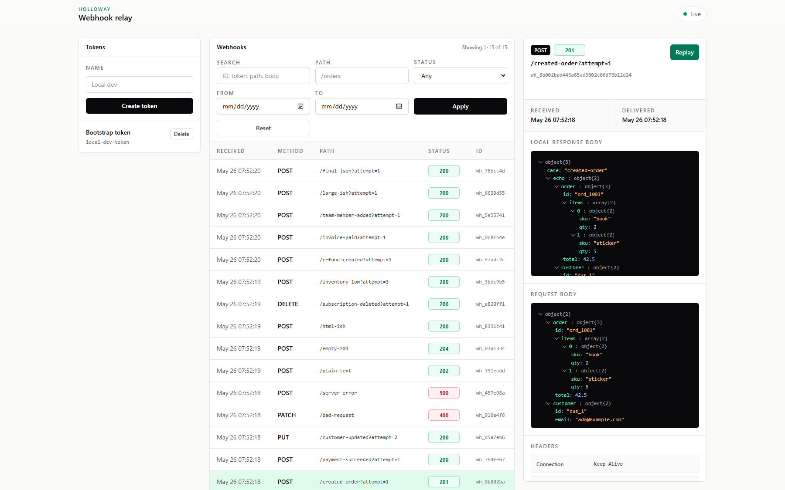

# Holloway

Self-hosted webhook relay written in Go. Persistent SQLite storage, live dashboard, one-binary deploy. Alternative to Smee and ngrok for people who need durability over convenience.

Holloway is a self-hosted webhook relay for local development. It is meant to be the boring, durable alternative to Smee-style webhook forwarding: receive on your VPS, persist to SQLite, forward to your laptop when connected, and replay when needed.

<p align="center">
  
</p>

- `holloway-server` runs on a VPS.
- `holloway` runs on your machine and forwards webhooks to localhost.

Every webhook is written to SQLite before delivery is attempted. If the client is offline, the webhook stays pending with `status_code = 0` and is drained when the client reconnects.

## Why Holloway?

Smee, ngrok, and similar tools are good at live forwarding. Holloway is for the part that hurts in real webhook work: the request that arrives while your laptop is asleep, your dev server is restarting, or your tunnel is disconnected.

Holloway writes every webhook to SQLite before it tries delivery. If your client is offline, the request stays queued. When you reconnect, pending webhooks drain automatically. If a payload exposed a bug, you can inspect it and replay it from the dashboard instead of trying to trigger the provider again.

Use Holloway when losing a webhook costs more time than running a small relay.

## 60-second local setup

```sh
go build -o bin/holloway-server ./cmd/holloway-server
go build -o bin/holloway ./cmd/holloway
```

Start your local app on port 3000. Holloway forwards incoming webhooks to that port.

Start the server:

```sh
HOLLOWAY_ADMIN_PASSWORD=admin \
HOLLOWAY_BOOTSTRAP_TUNNEL_SECRET=local-dev-tunnel-secret \
./bin/holloway-server -addr :8080 -bootstrap-token local-dev-token
```

Connect the client:

```sh
./bin/holloway connect --server ws://localhost:8080 --token local-dev-token --secret local-dev-tunnel-secret --port 3000
```

Send a webhook:

```sh
curl -X POST http://localhost:8080/hook/local-dev-token -d '{}'
```

Open the dashboard:

```txt
http://localhost:8080/dashboard
```

The dashboard uses Basic Auth. The username is ignored; the password must match `HOLLOWAY_ADMIN_PASSWORD`.

## Server

```sh
holloway-server \
  -addr :8080 \
  -db holloway.db \
  -templates templates \
  -static static \
  -webhook-rate-limit 300 \
  -bootstrap-token local-dev-token \
  -bootstrap-tunnel-secret local-dev-tunnel-secret
```

Environment variables:

- `HOLLOWAY_ADDR` - listen address, default `:8080`
- `HOLLOWAY_DB` - SQLite path, default `holloway.db`
- `HOLLOWAY_TEMPLATES` - template directory, default `templates`
- `HOLLOWAY_STATIC` - static directory, default `static`
- `HOLLOWAY_BOOTSTRAP_TOKEN` - optional initial token. No token is created by default.
- `HOLLOWAY_BOOTSTRAP_TUNNEL_SECRET` - tunnel secret for the bootstrap token. Required when `HOLLOWAY_BOOTSTRAP_TOKEN` is set.
- `HOLLOWAY_ADMIN_PASSWORD` - required Basic Auth password for dashboard and token management
- `HOLLOWAY_ALLOW_INSECURE_ADMIN` - set to `true` only for local-only development without dashboard authentication
- `HOLLOWAY_WEBHOOK_RATE_LIMIT` - webhook requests per token per minute, default `300`. Requests over the limit return `429` before they are persisted.

## Client

```sh
holloway connect --server wss://hooks.example.com --token tok_abc --secret tsec_abc --port 3000
```

Replay the last 10 stored webhooks after connecting:

```sh
holloway connect --server wss://hooks.example.com --token tok_abc --secret tsec_abc --port 3000 --replay 10
```

The client logs connection state and each forwarded webhook.

The webhook token goes in provider URLs. The tunnel secret is only for the local client and is sent as a WebSocket `Authorization: Bearer ...` header.

## Install from source

```sh
go install github.com/jolovicdev/holloway/cmd/holloway@v0.1.0
go install github.com/jolovicdev/holloway/cmd/holloway-server@v0.1.0
```

## API

Webhook ingress:

```sh
curl -X POST https://hooks.example.com/hook/<token>/orders -d '{"id":1}'
```

Token creation:

```sh
curl -u ":$HOLLOWAY_ADMIN_PASSWORD" \
  -H "Origin: https://hooks.example.com" \
  -X POST https://hooks.example.com/tokens \
  -d "name=laptop"
```

The token creation response includes the generated `tunnel_secret`. Save it when it is shown; Holloway stores only a hash.

Admin POST requests require a same-origin `Origin` or `Referer` header.

Dashboard:

```txt
GET /dashboard
GET /dashboard/events
GET /dashboard/webhooks/:id
POST /dashboard/replay/:id
POST /tokens
POST /tokens/:id/delete
```

The dashboard webhook list is paginated and supports `q`, `path`, `status`, `from`, and `to` query parameters. Date filters use `YYYY-MM-DD`.

## Dashboard assets

The dashboard does not load CSS or JavaScript from a CDN. Tailwind CSS v4 and htmx are checked in under `static/`, so build and deploy only need Go plus the template and static directories.

## Deploy with Docker Compose

```sh
export HOLLOWAY_ADMIN_PASSWORD='change-this'
export HOLLOWAY_BOOTSTRAP_TOKEN='use-a-long-random-token'
export HOLLOWAY_BOOTSTRAP_TUNNEL_SECRET='use-another-long-random-token'
docker compose up -d --build
```

Point Caddy at the container:

```caddy
holloway.example.com {
	reverse_proxy holloway:8080
}
```

## Build releases

```sh
make build
```

Builds Linux, macOS, and Windows binaries under `bin/`.

## License

MIT.

## How it works

```txt
[GitHub / Stripe] -- POST /hook/{token} --> [holloway-server]
                                              |
                                              v
                                        [SQLite write]
                                              |
                                              v
                                      [WebSocket tunnel]
                                              |
                                              v
                                       [holloway client]
                                              |
                                              v
                                        localhost:3000
```
